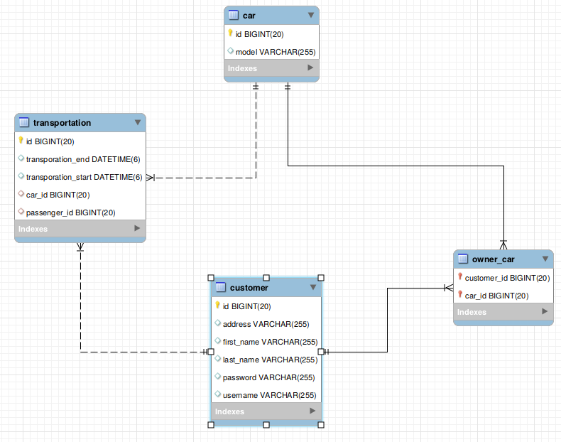

# Exercise JPA and Spring Testing

Please help N3rdyB00ks out:

* We want to extend our business by offering additional CarPooling services.
* Also, we want our development to happen TDD-style from now on ;-)

## Task 1: Extend the data model so the following tables are added

* Customers can offer their own cars for car pooling (a car can be owned by multiple customers, a customer can own multiple cars)
* Customers can participate in transportations (using the aforementioned cars)

Adapt/add entity classes as needed until the tables in MySQL match the diagram.

## Task 2: Fix the following tests in CarControllerTest by implementing the CarController

* shouldReadAllCars
* shouldFindOneCar
* shouldFindTwoCars
* shouldBeAbleToUploadACar

## Task 3: Implement the following test cases in CarControllerTest

* shouldBeAbleToModifyACar
* shouldBeAbleToDeleteACar

NOTE: This may also involve implementing additional functionality in CarController